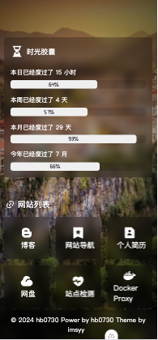

# home-page
>
> 源自于[imsyy/home](https://github.com/imsyy/home)的开源项目
>

|  |  |
| --- | --- |
|||
|||

## 功能

- [x] 载入动画
- [x] 个人信息
- [x] 日期及时间
- [x] 实时天气
- [x] 时光进度条
- [x] 移动端适配

## 静态部署

```shell
# 安装pnpm
npm install -g pnpm
# 安装依赖
pnpm install
# 构建静态部署
pnpm generate
```

## 相关配置

1. **网站信息**,**社交信息**等配置修改 `app.config.ts` 相关配置
2. **天气**,**一言**等api配置修改 `utils/*`相关配置
3. **背景图片**修改 `composables/useGlobal.ts`相关配置

## API

- [教书先生 API](https://api.oioweb.cn/doc/weather/GetWeather)
- [Hitokoto 一言](https://hitokoto.cn/)
- [小歪 API](https://api.aixiaowai.cn/)
- [樱花二次元图片API](https://www.dmoe.cc/random.php)

## 技术栈

- [Nuxt.js](https://nuxtjs.org/)
- [vue3](https://cn.vuejs.org/)
- [TypeScript](https://www.typescriptlang.org/)
- [unocss](https://unocss.com/)
- [pnpm](https://pnpm.io/)
- [iconfont](https://www.iconfont.cn/)

## License

[MIT](https://mit-license.org/)
